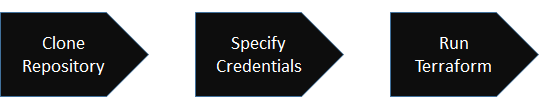
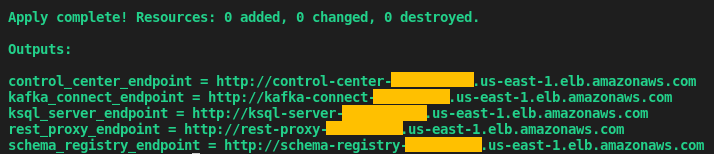

# Confluent Cloud Tools

"As a developer, you want to build applications, not infrastructure" -- this is the pilosophy behind [Confluent Cloud](https://www.confluent.io/confluent-cloud), A resilient and scalable streaming data service based on Apache Kafka, delivered to you as a fully managed service.
Unlike proprietary services, Confluent Cloud is compatible with the open-source Kafka APIs that you know and love -- which in turn unleashes access to the vibrant Kafka ecosystem that includes [Schema Registry](https://docs.confluent.io/current/schema-registry/docs/index.html), [REST Proxy](https://docs.confluent.io/current/kafka-rest/docs/index.html), [Kafka Connect](https://docs.confluent.io/current/connect/index.html), [KSQL](https://docs.confluent.io/current/ksql/docs/index.html) and the [Control Center](https://docs.confluent.io/current/control-center/index.html).

Though Confluent Cloud takes care of managing Zookeeper and the Kafka brokers for you; **currently it doesn't include the ecosystem mentioned before** so you would need to manually provision them by yourself. This project is based on [Terraform](https://www.terraform.io) that allows you to have the ecosystem running in the Cloud -- and automatically connected to the Kafka cluster. All you have to do is:

<p align="center">
    
</p>

The provisioning process usually takes about ~5 minutes.

Quickstart
----------

The first thing you need to do is clone the repository. So go ahead and get yourself a copy of the Confluent Cloud Tools:

```bash
    $ git clone git@github.com:confluentinc/ccloud-tools.git <ENTER>
```
Next, navigate to the folder that contains your Cloud provider implementation (i.e.: terraform/aws) and set up the credentials information from your Cloud provider in the **cloud.auto.tfvars** file. Please note that each Cloud provider has their own way to specify these credentials.

You are going need to edit the **ccloud.auto.tfvars** file as well to specify information from your Confluent Cloud cluster. This information can be easily obtained via the dashboard. Go to your cluster and then access the Client Config tab. There, you can create new API keys and secret, as well as retrieve your cluster bootstrap servers. If you are new to Confluent Cloud -- you might want to watch the [Getting Started with Confluent Cloud Professional](https://www.youtube.com/watch?v=JTPjfk51s3c) video.

Finally, you will need to run Terraform. While under the folder that contains your Cloud provider implementation, run:

```bash
    $ terraform init <ENTER>
    $ terraform plan <ENTER>
    $ terraform apply <ENTER>
```
Once the script finishes, there will be an output showing this:

<p align="center">
    
</p>

License
-------

The project is licensed under the Apache 2 license.