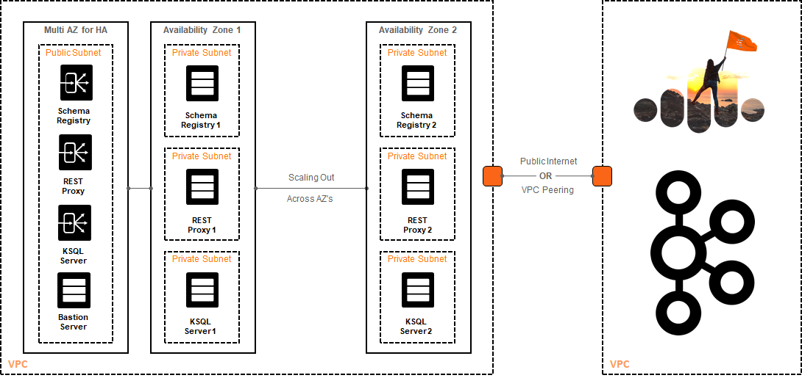

# Confluent Cloud Tools

This is an unofficial open-source project created to aid in quickly provisioning Confluent Platform Tools (i.e.: [REST Proxy](https://docs.confluent.io/current/kafka-rest/docs/index.html), [Kafka Connect](https://docs.confluent.io/current/connect/index.html), [KSQL](https://docs.confluent.io/current/ksql/docs/index.html), [Control Center](https://docs.confluent.io/current/control-center/index.html)) to be used while developing applications with [Confluent Cloud](https://www.confluent.io/confluent-cloud).

This project is based on [Terraform](https://www.terraform.io) and allows you to have the ecosystem running in the Cloud—and automatically connected to the Apache Kafka cluster. All you have to do is:

<p align="center">
    
</p>

The provisioning process may take about ~5 minutes. Once it is finished, the tools will be available to use right way via the publicly exposed load balancers. The diagram below shows how this works.

<p align="center">
    
</p>

Quickstart
----------

The first thing you need to do is clone the repository. So go ahead and get yourself a copy of the Confluent Cloud Tools:

```bash
    $ git clone git@github.com:confluentinc/ccloud-tools.git <ENTER>
```

Alternatively, if you don't have Git installed in your computer you can simply click on the green button 'Clone or Download' available in the top of this Github repository. This will download a fresh copy of the code straight from the master branch.

Next, navigate to the folder that contains your Cloud provider implementation (i.e.: terraform/aws) and set up the credentials information from your Cloud provider in the **cloud.auto.tfvars.example** file. Before running Terraform, make sure to remove the ".example" suffix. Also note that each Cloud provider has their own way to specify these credentials.

You are going need to edit the **ccloud.auto.tfvars.example** file as well to specify information from your Confluent Cloud cluster. Before running Terraform, make sure to remove the ".example" suffix. The information from the Confluent Cloud cluster can be easily obtained via the dashboard. Go to your cluster and then access the Client Config tab. There, you can create new API keys and secret, as well as retrieve your cluster bootstrap servers. If you are new to Confluent Cloud -- you might want to watch the [Getting Started with Confluent Cloud](https://www.youtube.com/watch?v=JTPjfk51s3c) video.

Finally, you will need to run Terraform (which you can [download from here](https://www.terraform.io/downloads.html) if you do not have it already). While under the folder that contains your Cloud provider implementation, run:

```bash
    $ terraform init <ENTER>
    $ terraform plan <ENTER>
    $ terraform apply <ENTER>
```
Once the script finishes, there will be an output showing this:

<p align="center">
    
</p>

As you can see in the output shown above, there is a bastion server you can use to SSH into the internal VMs. The bastion server is the only way in into the VMs, so for this reason it is disabled by default. To enable it, edit the **variables.tf** file and modify the instance_count variable, setting the value of bastion_server to **1**.

License
-------

The project is licensed under the Apache 2 license.
